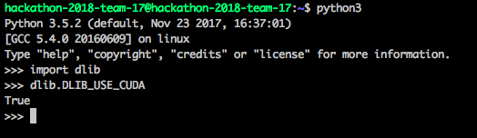
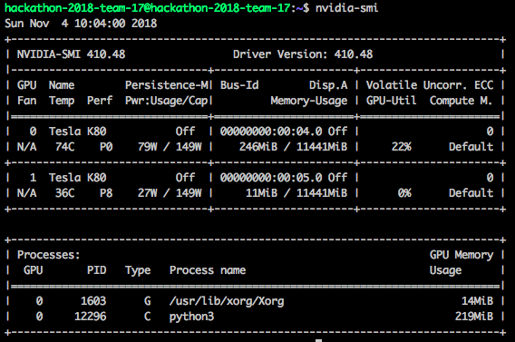
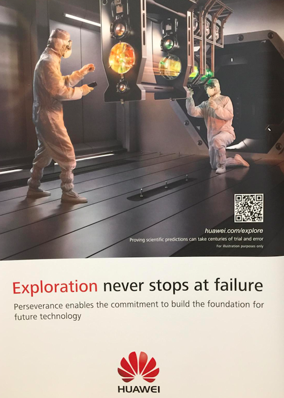

# Huwawei Computer Vision Hackathon

## Our approach
1. Use Bing API to download pictures from the celebrity (250 pictures ~ 2 min)
2. Create embeddings (feature vectors) for each of the images collected in our dataset (128-D vectors extracted with CNN) using the official face_recognition library with GPU support (~ 3 min)
3. Use the face_recognition to detect faces each second using CNN
4. Use triplets (Similarity Learning) to compute the distance from each face detected to our embeddings.

## Environment
We worked locally using Docker-Compose and then installed all the libraries manually to the server (Including the DLIB library with CUDA support!), where we spent 70% of the hackathon time :/

